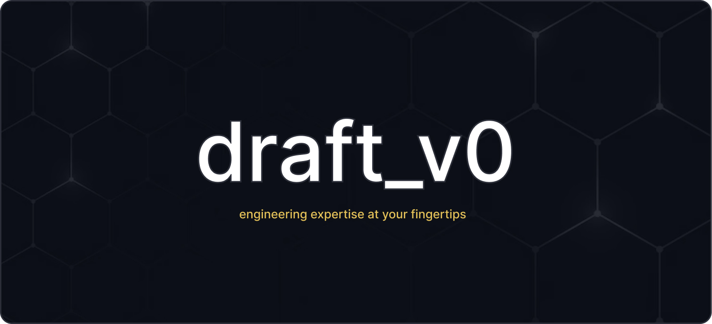

# Draft_v0



**"We don't have time for that" is no longer an answer.** Draft_v0 puts senior engineering expertise at your fingertips; 17 skills, 8 agents, and 12 prompt templates that handle the code so your team stops compromising on the design. Micro-interactions, pixel-perfect fidelity, design system consistency in every PR. Not backlog items. Not phase 2. Just the product you actually designed.

[](https://github.com/michelve/draft_v0/actions/workflows/dependabot/dependabot-updates)
[](https://github.com/michelve/draft_v0/actions/workflows/e2e.yml)
[](LICENSE)

[](https://www.typescriptlang.org/)
[](https://react.dev/)
[](https://getbootstrap.com/)
[](https://vitejs.dev/)
[](https://www.prisma.io/)
[](https://pnpm.io/)

## Why Draft_v0?

Every team has the same conversation: _"We love the design, but we don't have time to build it that way."_ Draft_v0 ends that conversation. The engineering complexity; architecture, conventions, API wiring, state management; is already solved. Your AI assistant knows the stack as well as your best engineer. What used to take a sprint takes an afternoon.

- **Figma URL → production component** - paste a link, get a pixel-perfect, accessible, design-system-compliant component. No translation layer, no back-and-forth
- **Your design system is encoded** - tokens, variants, spacing, motion. Every AI-generated component follows your rules without you having to explain them
- **Micro-interactions ship on day one** - hover states, transitions, loading skeletons. Not "nice to haves." Not phase 2. Just done
- **No revision cycles** - AI produces code that matches your conventions on the first try, because the conventions are baked in as skills
- **Autonomous problem-solving** - agents fix build errors, review PRs for design system drift, and research solutions without pulling engineers away from building
- **One-command workflows** - `figma-to-code`, `build-page`, `gh-new-pr` chain everything together so the path from Figma to merged PR is as short as possible

## How It Works

Draft_v0 ships a complete AI development system on top of the scaffold. Designers get Figma-to-code workflows that just work. Developers get an AI assistant that already knows the architecture, patterns, and conventions - no handholding needed.

| Component               | What it does                                                                                                                                                                                                                                |
| ----------------------- | ------------------------------------------------------------------------------------------------------------------------------------------------------------------------------------------------------------------------------------------- |
| **17 Skills**           | Teach your AI the exact patterns, conventions, and anti-patterns for every layer of the stack - React 19, Express, Prisma, DSAi, Figma, and more. AI produces correct code on the first attempt, not after three correction rounds          |
| **8 Agents**            | Autonomous workers: fix TypeScript errors, review code for architectural consistency, plan refactors with risk assessments, research solutions across the internet. Multi-step tasks that would interrupt a developer run in the background |
| **12 Prompt templates** | One-click workflows that chain skills together - `figma-to-code` translates a Figma URL into a production component, `build-page` scaffolds a full route, `gh-new-pr` handles commit, PR, and description in one shot                       |
| **Task system**         | File-based tasks with AI-powered breakdown (Example Mapping) and verification (PASS/FAIL/NEED_INFO). Work is tracked, verifiable, and never lost between sessions                                                                           |
| **ADRs**                | Architecture Decision Records capture the _why_ behind every significant choice. New team members (and AI assistants) understand the reasoning, not just the result                                                                         |
| **Figma pipeline**      | Two MCP servers + Code Connect, pre-configured. Your Figma components are linked to your code components - the AI sees both and keeps them in sync                                                                                          |

## Tech Stack

| Layer        | Technology                                                                       |
| ------------ | -------------------------------------------------------------------------------- |
| **Frontend** | React 19, TypeScript, TanStack Router + Query, DSAi Design System, Bootstrap 5.3 |
| **Backend**  | Node.js, Express, TypeScript                                                     |
| **Database** | Prisma ORM (SQLite default)                                                      |
| **State**    | TanStack Query (server), Zustand (client), React Hook Form + Zod (forms)         |
| **Build**    | Vite 6, TypeScript strict mode                                                   |
| **Testing**  | Vitest (unit), Playwright (e2e)                                                  |
| **Quality**  | Biome, ESLint, Prettier                                                          |
| **Design**   | Figma MCP servers, Figma Code Connect                                            |

## Quick Start

```bash
git clone https://github.com/michelve/draft_v0.git
cd draft_v0
pnpm install
cp .env.example .env
pnpm db:push
pnpm dev
```

Open http://localhost:5173 (frontend) - API runs on http://localhost:3001.

## Project Structure

```text
src/
├── client/              # React 19 SPA (Vite)
│   ├── routes/          # TanStack Router file-based routes
│   ├── components/      # Custom UI components (Button, Typography, etc.)
│   ├── lib/             # Utilities (query-client, helpers)
│   └── hooks/           # Custom React hooks
├── server/              # Express API
│   ├── routes/          # API route handlers
│   ├── controllers/     # Request/response handling
│   ├── services/        # Business logic
│   ├── repositories/    # Prisma data access
│   └── lib/             # Shared (prisma client)
prisma/
└── schema.prisma        # Database schema (SQLite default)
```

**Architecture:** Route → Controller → Service → Repository → Prisma (layered, each layer has one job).

## Available Commands

| Command            | Purpose                                  |
| ------------------ | ---------------------------------------- |
| `pnpm dev`         | Start Vite + Express dev servers         |
| `pnpm build`       | TypeScript check + Vite production build |
| `pnpm typecheck`   | Run `tsc --noEmit` on both configs       |
| `pnpm lint`        | ESLint check                             |
| `pnpm biome:check` | Biome lint + format check                |
| `pnpm test`        | Vitest unit tests                        |
| `pnpm test:e2e`    | Playwright end-to-end tests              |
| `pnpm db:push`     | Push Prisma schema to database           |
| `pnpm db:studio`   | Open Prisma Studio                       |
| `pnpm db:generate` | Regenerate Prisma client                 |

## AI Ecosystem

### Skills (17)

Domain-specific knowledge that teaches AI assistants your project's patterns:

| Category     | Skills                                                                           |
| ------------ | -------------------------------------------------------------------------------- |
| **Frontend** | react, react-best-practices, dsai, web-design-guidelines                         |
| **Backend**  | nodejs, prisma, route-tester                                                     |
| **Workflow** | create-tasks, task-check, writing-tests, playwright-skill, automatic-code-review |
| **Design**   | figma, figma-implement-design                                                    |
| **Meta**     | skill-creator                                                                    |

### Agents (8)

Specialized workers for autonomous multi-step tasks:

| Agent                      | Purpose                                        |
| -------------------------- | ---------------------------------------------- |
| auto-error-resolver        | Fix TypeScript/build errors systematically     |
| code-architecture-reviewer | Review code for best practices and consistency |
| code-refactor-master       | Refactor with dependency tracking              |
| documentation-architect    | Create and enhance documentation               |
| plan-reviewer              | Review plans before implementation             |
| principal-engineer         | First-principles engineering analysis          |
| refactor-planner           | Create refactoring plans with risk assessment  |
| web-research-specialist    | Research solutions across the internet         |

### Prompt Templates (12)

One-click workflows: `build-page`, `figma-to-code`, `commit`, `pr`, `gh-new-pr`, `gh-debug-issue`, `gh-fix-ci`, `gh-pr-comments`, `make-moves`, `changeset`, `ralph-plan`, `create-skill`.

## Adding UI Components

Custom Bootstrap-based components live in `src/client/components/ui/`. Use DSAi design tokens (`--dsai-*` CSS variables) and Bootstrap utility classes for styling.

Build tokens with:

```bash
pnpm tokens:build
```

## Figma Integration

1. Get a [Figma Personal Access Token](https://www.figma.com/developers/api#access-tokens)
2. Add `FIGMA_API_KEY` to `.env`
3. Use the `figma-to-code` prompt with a Figma URL

Two MCP servers (figma-developer-mcp, figma-console-mcp) are pre-configured in `.vscode/mcp.json`.

## Documentation

| Guide                                                           | Description                       |
| --------------------------------------------------------------- | --------------------------------- |
| [Getting Started](docs/guides/getting-started.md)               | Full setup walkthrough            |
| [Project Structure](docs/guides/project-structure.md)           | Architecture and directory layout |
| [Skills & Agents](docs/guides/skills-and-agents.md)             | Complete AI ecosystem reference   |
| [Tasks Workflow](docs/guides/tasks-workflow.md)                 | File-based task management system |
| [Figma Integration](docs/guides/figma-integration.md)           | Design-to-code pipeline           |
| [Architecture Decisions](docs/guides/architecture-decisions.md) | ADR system and existing decisions |

## Quality Gates

All must pass before committing:

```bash
pnpm typecheck      # Zero TypeScript errors
pnpm biome:check    # Zero Biome lint/format errors
pnpm lint           # Zero ESLint errors
pnpm build          # Clean production build
```

## Security

See [SECURITY.md](SECURITY.md) for how to report vulnerabilities. Please use GitHub Private Vulnerability Reporting - do not open public issues for security concerns.

## Code of Conduct

This project follows the [Contributor Covenant v2.1](CODE_OF_CONDUCT.md). By participating, you agree to uphold these standards. Report violations via a [GitHub Issue](https://github.com/michelve/draft_v0/issues).

## License

This project is licensed under the [MIT License](LICENSE).
